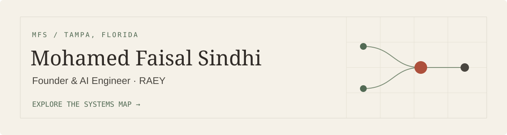

I’m Faisal, founder of **RAEY** and a Graduate Teaching Assistant working on healthcare AI at the University of South Florida. I build retrieval systems and study how to check the answers they produce.

My work has taken me from operations in Bahrain to web development in Chennai, blockchain engineering in the UAE, and AI research in Tampa.

**[Explore my portfolio ↗](https://portfoilio-faisal.vercel.app/)** · [Research notes](https://portfoilio-faisal.vercel.app/research) · [LinkedIn](https://www.linkedin.com/in/mdfaisalsindhi/) · [Contact](https://portfoilio-faisal.vercel.app/contact)

## Choose your way in

The portfolio’s Systems Map connects projects, roles, and capabilities. Each link opens a different route through that work.

| Your interest | Start here |
| :--- | :--- |
| Hiring | [Recruiter: outcomes and experience →](https://portfoilio-faisal.vercel.app/#path=recruiter) |
| Engineering | [Technical reviewer: retrieval, verification, and evaluation →](https://portfoilio-faisal.vercel.app/#path=technical-reviewer) |
| Healthcare | [Healthcare AI: RAEY, SENTINEL, and teaching →](https://portfoilio-faisal.vercel.app/#path=healthcare-ai) |
| Research | [Researcher: methods, findings, and limitations →](https://portfoilio-faisal.vercel.app/#path=researcher) |
| Building a company | [Founder journey: operations to RAEY →](https://portfoilio-faisal.vercel.app/#path=founder-journey) |

## Questions I’m working on

<strong>RAEY · Can an SOP answer be traced to its supporting passage?</strong>

I founded RAEY and built its retrieval and verification stack. It is **pre-launch**. A 218-case evaluation caught 85% of answers with unsafe errors while passing 82% of valid answers.

The portfolio’s local product demonstrations use a mock provider and synthetic SOP data. They do not show hospital information or a production deployment.

[Case study](https://portfoilio-faisal.vercel.app/projects/raey) · [Public research log](https://github.com/MdFaisalS2025/RAEY-SOP-Research)

<strong>F-1 Policy Intelligence · When should a policy assistant decline to answer?</strong>

An independent question-answering project combining dense retrieval, PostgreSQL full-text search, reranking, and citations. On a 28-question evaluation set, it recorded 100% abstention accuracy and 99.3% citation faithfulness.

**Not an official USF service.** Students should confirm decisions with USF International Services or an immigration attorney.

[Case study](https://portfoilio-faisal.vercel.app/projects/f1-policy-intelligence) · [Repository](https://github.com/MdFaisalS2025/USF_F1_policy_intelligence) · [Live demo](https://usf-f1-policy-intelligence.vercel.app/)

<strong>SENTINEL · Can specialized agents explain an earlier deterioration alert?</strong>

I designed a six-agent research system and compared four reasoning approaches. In evaluation on synthetic patient data, SENTINEL detected deterioration 2.7 hours earlier than NEWS2. The simpler rule-based baseline outperformed the heavier reasoning approaches.

That lead time is an evaluation result, not a claim about clinical production performance.

[Case study and system flow](https://portfoilio-faisal.vercel.app/projects/sentinel)

<strong>Three more investigations · Legal citations, federated learning, and data interfaces</strong>

- **[Swiss Legal RAG](https://portfoilio-faisal.vercel.app/projects/swiss-legal-rag):** retrieval across 175K legal articles and 2.4 GB of court records. Zero fabricated citations in evaluation and a 19% macro-F1 improvement over baseline.
- **[AI Control Hub](https://portfoilio-faisal.vercel.app/projects/ai-control-hub):** federated maintenance prediction across simulated clients. Detected 80% of failures in evaluation; the cost model projected approximately $400K in annual savings.
- **[Conversational AI Data Explorer](https://portfoilio-faisal.vercel.app/projects/data-explorer):** a three-person team project. My contribution focused on frontend development, deployment, and chatbot integration. [Repository](https://github.com/MdFaisalS2025/ISM-6225_US-states-website).

## How the work connects

**Retrieval and evaluation:** [RAG](https://portfoilio-faisal.vercel.app/#node=capability-rag), [verification](https://portfoilio-faisal.vercel.app/#node=capability-verification), [evaluation](https://portfoilio-faisal.vercel.app/#node=capability-evaluation).

**Engineering:** Python, C++, Next.js, Docker, SQL, and PostgreSQL. Earlier work includes blockchain name services, wallet integrations, and privacy-preserving machine learning.

**Beyond the current projects:** [Explore smaller experiments](https://portfoilio-faisal.vercel.app/projects), including a C++ racing simulator with a DQN agent and a building-energy prediction workflow.

---

Open to AI engineering opportunities, research collaborations, and thoughtfully scoped product work involving trustworthy retrieval, healthcare AI, multi-agent systems, and applied machine learning.

**[Get in touch](https://portfoilio-faisal.vercel.app/contact)** · [Experience](https://portfoilio-faisal.vercel.app/experience) · [Credentials](https://portfoilio-faisal.vercel.app/credentials)
